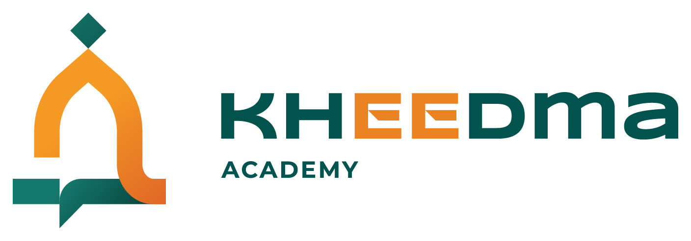

<p align="center">
  
</p>

<h3 align="center">Serving with Purpose, Growing with Barakah</h3>

<p align="center">
  Muslim growth partner yang membimbing pemula tumbuh menjadi<br>
  affiliate marketer yang amanah dan profesional.
</p>

<p align="center">
  <a href="https://kheedma.hyperscore.cloud"></a>
</p>

<p align="center">
  
  
  
  
  
  
</p>

---

## ✦ Tentang

**Kheedma Academy** adalah bagian dari Kheedma, sebuah agency berbasis nilai Islam.
Academy hadir untuk membimbing individu, dari nol, melewati masa observasi terbimbing,
lalu mengantar yang sungguh-sungguh untuk berkembang dengan cara yang **halal, terukur,
dan berkah**. Bukan kursus "cepat kaya", tetapi sebuah proses yang dibimbing.

> Khidmat · Amanah · Itqan · Barakah

## ✦ Yang ada di v1

- 🌿 **Situs promosi** yang menceritakan kisah dan nilai Kheedma Academy
- 📝 **Formulir pendaftaran** dengan tugas pra-seleksi (menyaring kesungguhan, bukan uang)
- 🛠️ **Panel admin** untuk mencatat pelamar, cohort, mentor, dan perjalanan setiap peserta
- 🗂️ **Fondasi data relasional** sebagai sumber kebenaran sejak hari pertama

## ✦ Roadmap

| Tahap | Fokus | Status |
|:-----:|-------|:------:|
| **Layer 1** | Situs promosi + formulir pendaftaran | 🚧 Berjalan |
| **Layer 2** | Panel admin (operasional cohort) | ⏳ Berikutnya |
| **Layer 3+** | Penyempurnaan iteratif setelah cohort nyata | 🔭 Nanti |

## ✦ Teknologi

Dibangun di atas **Laravel 13** dengan situs publik server-rendered (**Blade + Tailwind v4**)
dan panel admin sebagai **SPA Vue 3**. Aset dibundel dengan **Vite**, identitas visual
mengikuti *Brand Guidelines* Kheedma (teal & orange, Syncopate & Montserrat).

## ✦ Menjalankan secara lokal

Proyek ini berjalan di atas **Laragon**.

```bash
composer install
npm install
cp .env.example .env && php artisan key:generate
php artisan migrate
npm run dev
```

Akses di **http://kheedma-academy.local** (publik) dan **/admin** (panel admin).

## ✦ Deployment

Deploy ke VPS memakai pola atomic (zero-downtime). Lihat **[`docs/deploy/README.md`](docs/deploy/README.md)**.

---

<p align="center">
  <sub>© Kheedma Academy · Khidmat · Amanah · Itqan · Barakah</sub>
</p>
