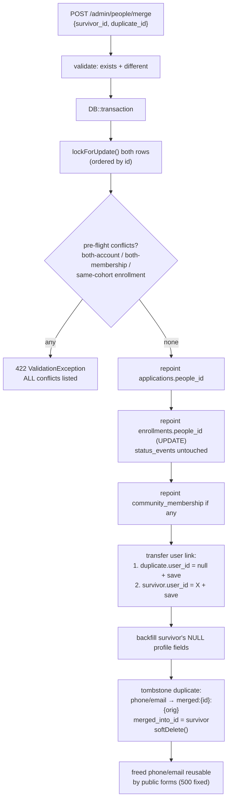

# Manajemen Orang — People Directory, Account Card & Person Merge

## Context

The admin panel manages staff ("Tim") but has no surface for participants/members: no directory of all Persons, no admin actions on participant accounts (deactivate / reset password), and no way to merge duplicate Persons — the safety valve promised since the v1 concept (the people-table migration comment even describes the merge flow). A latent production bug compounds this: `people.phone`/`people.email` carry plain DB unique indexes (`2026_06_17_100002_create_people_table.php:17-18`) that include soft-deleted rows, while `StoreApplicationRequest:33-42` and `CommunityJoinRequest:29-35` validate uniqueness with `->whereNull('deleted_at')` — so any soft-deleted Person's phone/email crashes with a raw 500 when reused (validation passes, insert violates the index). This package delivers the staged approach the user approved (Person detail = management hub; "Orang" directory = mini-CRM; role changes stay in Tim) and fixes the latent bug via the merge tombstone strategy. PDP anonymize is deferred (opposite audit semantics; needs its own spec).

**All permissions already exist** in `PermissionSeeder` — `people.view` (admin+mentor), `people.merge` (admin, seeded but unused until now), `users.manage` (admin). No seeder changes.

## Key design decisions

1. **Tombstone strategy (fixes the latent 500):** on merge, mangle the duplicate's unique fields before soft-delete — both become `merged:{duplicateId}:{original}` (truncated to 255). Safe because: inert to the phone regex `/^\+62\d{8,13}$/` forever, invalid as an email (unquoted colons), and unique by id-prefix construction. Also set a new nullable `people.merged_into_id` self-FK (audit trail; `deleted_at` doubles as merge timestamp). The freed real phone/email become reusable by future joins/applications — `Person::firstOrNew(['phone' => …])` in `ProvisionParticipantAccount` already excludes trashed rows via the SoftDeletes global scope, so a fresh Person row is created and the insert now succeeds. (Composite `(email, deleted_at)` unique indexes REJECTED: NULL is distinct in unique indexes → unlimited live rows could share an email.)
2. **Merge collision matrix (zero silent history loss)** — verified against actual constraints:
   - Both persons have accounts (`people.user_id` is UNIQUE) → **BLOCK** (422, Indonesian message)
   - Only duplicate has account → transfer: null duplicate's `user_id` + save FIRST, then set survivor's (never two rows holding one user)
   - Both have community membership (`community_memberships.people_id` UNIQUE) → **BLOCK**; only duplicate → repoint
   - Enrollment in the SAME cohort on both (`enrollments` UNIQUE `(people_id, cohort_id)`) → **BLOCK** (delete would cascade-destroy `status_events`); non-overlapping → repoint via UPDATE, never delete+recreate
   - Applications → always repoint (no unique constraint; attempt numbering is read-time in `PersonController::show`)
   - Survivor's NULL profile fields (`province_code`, `city_code`, `tiktok_username`, `instagram_username`) backfilled from the duplicate — survivor's own values always win
   - ALL conflicts collected and returned together (not first-fail); pre-flight runs in preview AND re-runs inside the merge transaction; `lockForUpdate()` on both rows (ordered by id to avoid deadlock)
3. **API shape:** `GET /admin/people/merge-preview?survivor_id&duplicate_id` returns `{can_merge, conflicts: [messages], moves: {applications, enrollments, membership, account}}` (200 even when blocked — preview is informational). `POST /admin/people/merge` throws `ValidationException` (422) with the conflict list when blocked; returns the moves summary on success. IDs validated with `exists:people,id` — the global SoftDeletes scope makes self-merge/double-merge/already-tombstoned targets fail validation naturally, plus an explicit `different:survivor_id` guard.
4. **UI convention:** the person page being viewed = survivor; "Gabungkan" searches for the duplicate (reusing the new directory endpoint `?q=`); confirm modal renders the preview payload (move counts) or the conflict list; after merge you stay on the survivor showing the moved records.
5. **Participant account actions** live on the person: `PATCH /admin/people/{person}/account` behind `users.manage`, with a defensive guard that the linked user has the `participant` role (staff accounts stay unreachable via this path — they're managed in Tim, which conversely only lists admin/mentor).
6. **Directory filters:** one `segment` param (`pendaftar` → `whereHas('applications')`, `komunitas` → `whereHas('communityMembership')`, `peserta` → `whereHas('enrollments')`, `berakun` → `whereNotNull('user_id')`) + name/phone/email search; `paginate(15)->withQueryString()` house pattern. Tombstones excluded automatically by the SoftDeletes global scope.

## Merge flow shape

## Tasks (in order; TDD each; house test pattern: `RefreshDatabase` + seed `RoleSeeder` + `PermissionSeeder` in `setUp`, `Person::create([...])` for fixtures — no PersonFactory exists and sibling tests don't use one)

| # | Task | Files |
|---|---|---|
| 0 | House plan doc: copy this plan to `docs/superpowers/plans/2026-07-07-people-management.md` (repo convention, sibling docs exist) | new doc |
| 1 | **Schema + merge metadata**: migration `add_merged_into_id_to_people_table` (nullable `foreignId('merged_into_id')->constrained('people')->nullOnDelete()`); `Person::mergedInto(): BelongsTo` / `mergedFrom(): HasMany` relations | new migration; `app/Models/Person.php` |
| 2 | **Directory endpoint**: `PersonController::index` — validate `q` (max:100) + `segment` (in:pendaftar,komunitas,peserta,berakun); `withCount('applications','enrollments')`, `->with('city:code,name')`, `exists`-style flags for membership/account; order latest; paginate(15). Route `GET /admin/people` → `permission:people.view` | `PersonController.php`; `routes/api.php` |
| 3 | **Merge action + endpoints**: `app/Actions/MergePeople.php` (style of `ProvisionParticipantAccount` — `DB::transaction` + `ValidationException`; exposes `preview()` and `merge()` sharing one conflict-collector). `GET /admin/people/merge-preview` + `POST /admin/people/merge` → `permission:people.merge`, handled by `PersonController` (mergePreview/merge methods). ⚠️ Register BOTH before `GET /admin/people/{person}` (routes/api.php:26) — the wildcard would swallow `merge-preview`. Includes the regression test: after merge, the freed phone+email submit cleanly through `POST` public apply & community join (the latent-500 fix) | new `app/Actions/MergePeople.php`; `PersonController.php`; `routes/api.php` |
| 4 | **Participant account actions**: `PATCH /admin/people/{person}/account` → `permission:users.manage` — accepts `is_active` (boolean) and/or `reset_password` (boolean) + optional `password` (min:8; when resetting without one, generate `Str::password(12)` and return `generated_password` once — mirror `UserController::store:52-66`). Guards: person must have a linked user (422), linked user must have role `participant` (422). `PersonController::show` gains an `account` block: `{exists, is_active, email, created_at}` (load `user` relation) | `PersonController.php`; `routes/api.php` |
| 5 | **Vue "Orang" directory**: `views/People.vue` following `Applicants.vue` verbatim pattern (debounced `q`, `segment` select via local `selectClass`, paginate, sessionExpired guard, row → RouterLink `{name:'person'}` — the existing `pelamar/:id` detail route); router: `path 'orang', name 'people', meta {permission:'people.view'}`; AppShell nav item `{icon: BookUser, label: 'Orang'}` after Pelamar (match `/orang`); `api.js` gains a `people` export (`list`, `mergePreview`, `merge`, `updateAccount`) | new `views/People.vue`; `router.js`; `AppShell.vue`; `api.js` |
| 6 | **Vue Person detail additions**: "Akun" card (no-account / active / nonaktif states; toggle + reset-password actions gated `auth.can('users.manage')`; generated-password shown-once `Dialog` like `Users.vue:146`) + "Gabungkan" flow gated `auth.can('people.merge')` (search duplicate via `people.list({q})`, preview modal rendering moves or conflicts, confirm, reload on success) | `views/PersonDetail.vue` |

Test files: `PersonDirectoryTest` (~8 cases: permission denied, search, each segment, soft-delete/tombstone exclusion, pagination shape), `PersonMergeTest` (~13 cases: happy repoint of applications/enrollments/membership, account transfer, both-account block, both-membership block, same-cohort block with `status_events` intact, all-conflicts-together, non-overlapping enrollments merge, self-merge 422, double-merge 422, tombstone format + `merged_into_id` set, freed-identity-reuse regression through the public forms, preview parity, permission denied), `PersonAccountTest` (~8 cases: toggle, generated reset, manual reset, no-account 422, staff-account 422 defense, permission denied, show includes account block). Task 1 assertions fold into `PersonMergeTest`.

## Reused existing machinery (verified)

- `ProvisionParticipantAccount` action shape (`DB::transaction` + `ValidationException::withMessages`, Indonesian messages) — `app/Actions/ProvisionParticipantAccount.php`
- `Str::password(12)` + `generated_password` shown-once — `UserController.php:52-66`; Vue dialog `Users.vue:67,146`
- List-endpoint shape (`validate` → `when(filled)` → `paginate(15)->withQueryString()->through`) — `ApplicantController::index`, `CommunityMemberController::index`
- `Phone::normalize` / `+62` regex context — `app/Support/Phone.php`, `StoreApplicationRequest`
- Vue: `Dialog`, `Badge`, `Button`, `Input`, per-view `selectClass`, `e.sessionExpired` guard, `fmtDate` — `Applicants.vue`, `Users.vue`, `PersonDetail.vue`
- Permissions & role wiring untouched — `PermissionSeeder.php:21-22,27` already has all three

## Execution & verification

- Branch `feat/people-management`. Implement tasks in order; per task: write tests first, implement, run the task's test file (`php artisan test --compact tests/Feature/<file>`), `vendor/bin/pint --dirty --format agent` per backend change.
- Gates: full suite (`php artisan test --compact`) green at each task boundary; `npm run build` green after Tasks 5–6 (no JS test runner in repo — Vue verified via build + the API contracts covered by PHPUnit).
- Deploy notes: one migration (`merged_into_id`); no seeder or dependency changes.
- Open PR when done.

## Deferred (recorded, not built)

- PDP anonymize action (needs own spec: which free-text fields are PII, irreversible-confirm UX)
- "Show tombstones" toggle in the directory
- Orders repointing in merge (table doesn't exist yet — the future orders phase must extend `MergePeople`)
